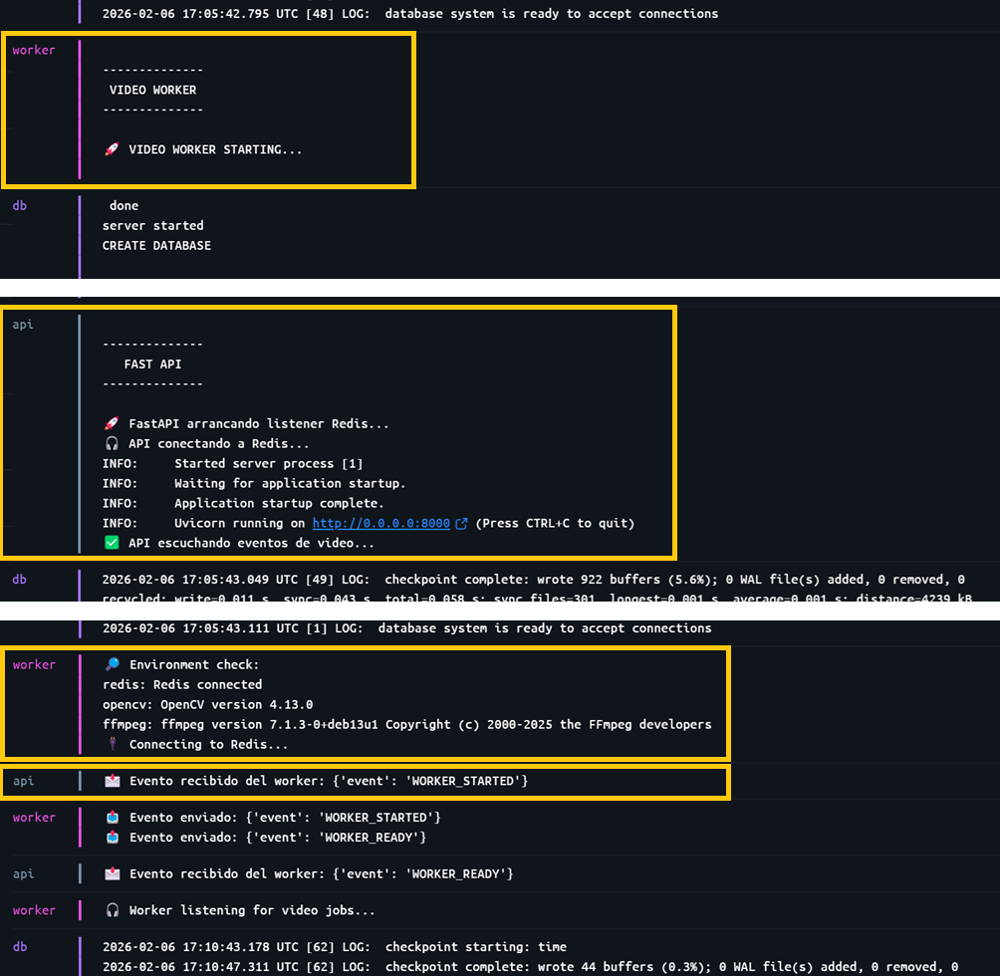

# 🐳 Entorno de Desarrollo con Docker — Rama dev-docker

Esta rama contiene infraestructura local, no features de negocio.
Sirve para que todo el equipo tenga el mismo entorno reproducible.

## Permite verificar:

- Docker funciona correctamente
- FastAPI levanta y responde
- Postgres acepta conexiones
- Redis está operativo
- MinIO está disponible como object storage
- El video worker arranca con OpenCV y FFmpeg
- Los contenedores se comunican entre sí por red interna

## 📁 Estructura del proyecto
```
project-root/
│
├── docker-compose.yml
│
├── api/
│   ├── Dockerfile          
│   ├── requirements.txt
│   └── main.py
│
├── worker/
│   ├── Dockerfile
│   ├── requirements.txt
│   └── main.py
│
└── README.md
```

## Flujo de la App:

           ┌────────────┐
           │   API      │
           └────┬───────┘
                │ crea job
                ▼
           ┌────────────┐
           │  Postgres  │
           └────┬───────┘
                │ job id
                ▼
           ┌────────────┐
           │   Redis    │ ← cola
           └────┬───────┘
                ▼
           ┌────────────┐
           │  Worker    │
           └──┬───────┬─┘
              │       │ ← actualiza DB
              │       ▼
              │    ┌────────────┐
              │    │  Postgres  │
              │    └────────────┘
              │
              │ publica evento
              ▼
           ┌────────────┐
           │   Redis    │ ← pub/sub
           └────┬───────┘
                ▼
         API / UI / mails / etc


## 🧩 Servicios

| Servicio      | Puerto | Función                |
| ------------- | ------ | ---------------------- |
| API (FastAPI) | 8000   | Backend principal      |
| Postgres      | 5432   | Base de datos          |
| Redis         | 6379   | Cola / cache           |
| Worker        | —      | Procesamiento de video |

## 🌍 Endpoints de prueba
| URL                                                    | Función              |
| ------------------------------------------------------ | -------------------- |
| [http://localhost:8000](http://localhost:8000)         | Health check         |
| [http://localhost:8000/env](http://localhost:8000/env) | Estado de DB y Redis |


## 🚀 Ejecutar el entorno completo

### Hacer Build y Up (logs en consola)
`docker compose up --build`

### Up (sin Build) y detached (sin logs, libera la consola)
`docker compose up -d`

### Bajar contenedores:
`docker compose down -v`

### Build y levantar solo API + DB + Redis
`docker compose up api db redis --build`

## 👀 Todo bien? (Logs docker desktop)

